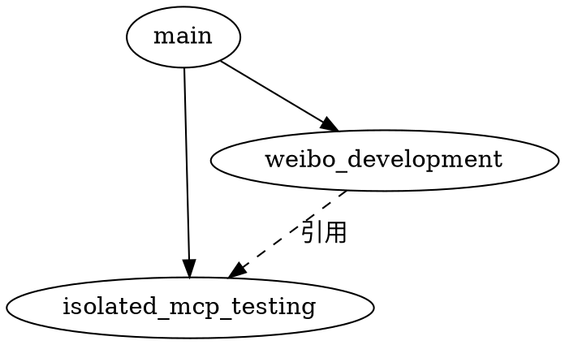

# 会话管理系统使用指南

## 🎯 系统架构

```
会话树结构
│
├── Main Session (主会话)
│   ├── 子 Session A (派发给 Agent A)
│   │   ├── 孙 Session A1
│   │   └── 孙 Session A2
│   ├── 子 Session B (派发给 Agent B)
│   └── 子 Session C (派发给 Agent C)
│       └── 引用了 Session A 的内容 ← 跨 Agent 知识共享
│
└── Archive (归档会话)
```

---

## 📂 目录结构

```
.qwen/
└── sessions/
    ├── session-tree.yaml          # 会话树索引（核心）
    ├── TEMPLATE.md                # 会话模板
    │
    ├── main/                      # 主会话
    │   ├── refs/                  # 挂载的其他会话
    │   └── *.md                   # 会话对话记录
    │
    ├── isolated-mcp-testing/      # 子会话
    │   ├── refs/                  # 挂载的其他会话
    │   └── *.md
    │
    └── weibo-development/         # 另一个子会话
        ├── refs/
        │   └── from-isolated-mcp-testing-*.md  # 从其他会话导出
        └── *.md
```

---

## 🔧 使用方法

### 1️⃣ 创建会话

```bash
# 创建主会话下的子会话
python .qwen/scripts/session_manager.py create --name "isolated-mcp 测试" --parent main

# 创建孙会话
python .qwen/scripts/session_manager.py create --name "测试方案设计" --parent isolated-mcp-testing
```

**效果**：
- 自动创建目录结构
- 生成元数据文件
- 更新会话树索引

---

### 2️⃣ 导出会话片段

```bash
# 将 isolated-mcp-testing 会话的工具列表导出到 weibo-development
python .qwen/scripts/session_manager.py export \
  --session isolated-mcp-testing \
  --file "2026-04-13_15-30_isolated-mcp-tools.md" \
  --target weibo-development \
  --purpose "为微博开发提供工具参考"
```

**效果**：
- 在 `weibo-development/refs/` 下创建引用文件
- 自动添加导出元数据头
- 记录到 session-tree.yaml

---

### 3️⃣ 挂载其他会话

```bash
# 在 weibo-development 中挂载 isolated-mcp-testing 的内容
python .qwen/scripts/session_manager.py mount \
  --session weibo-development \
  --ref isolated-mcp-testing \
  --file "2026-04-13_15-30_isolated-mcp-tools.md" \
  --purpose "需要 isolated-mcp 工具列表"
```

---

### 4️⃣ 查看会话树

```bash
python .qwen/scripts/session_manager.py tree
```

**输出示例**：
```
📊 会话树结构

============================================================
🟢 主会话
   ID: main
   创建: 2026-04-13T10:00
  └─ 🟢 isolated-mcp 测试
       ID: isolated-mcp-testing
       创建: 2026-04-13T15:30
  └─ 🟢 微博开发
       ID: weibo-development
       创建: 2026-04-13T16:00
============================================================
```

---

### 5️⃣ 列出所有会话

```bash
python .qwen/scripts/session_manager.py list
```

---

### 6️⃣ 查看导出记录

```bash
python .qwen/scripts/session_manager.py exports
```

---

## 💡 实际工作流示例

### 场景：Main Session 分发任务给多个 Agent

```
1. Main Session 中讨论项目整体规划
   ↓
2. Fork 出子 Session A：isolated-mcp 测试
   - 派发给 Agent A
   - Agent A 在独立会话中工作
   ↓
3. Fork 出子 Session B：微博开发
   - 派发给 Agent B
   - Agent B 需要参考 Agent A 的工作
   ↓
4. 从 Session A 导出工具列表
   - 挂载到 Session B 的 refs/ 目录
   - Agent B 可以看到 Agent A 的成果
   ↓
5. 两个 Agent 并行工作，互不干扰
```

### 实际操作步骤

#### 步骤 1：创建主会话
```bash
python .qwen/scripts/session_manager.py create --name "Power Media 开发" --parent main
```

#### 步骤 2：创建 isolated-mcp 测试会话
```bash
python .qwen/scripts/session_manager.py create \
  --name "isolated-mcp 测试" \
  --parent "power-media-development"
```

#### 步骤 3：在 isolated-mcp 测试中工作
- 记录对话内容到 `isolated-mcp-testing/` 目录
- 生成工具文档、测试方案等

#### 步骤 4：创建微博开发会话
```bash
python .qwen/scripts/session_manager.py create \
  --name "微博开发" \
  --parent "power-media-development"
```

#### 步骤 5：导出 isolated-mcp 工具列表给微博开发
```bash
python .qwen/scripts/session_manager.py export \
  --session isolated-mcp-testing \
  --file "2026-04-13_15-30_isolated-mcp-tools.md" \
  --target weibo-development \
  --purpose "微博开发需要参考 isolated-mcp 工具"
```

#### 步骤 6：在微博开发会话中使用导出的内容
- Agent B 在 `weibo-development/refs/` 中看到导出的工具列表
- 可以作为上下文参考

---

## 🔄 与 Qwen Code Agent 集成

### 使用 subagent-driven-development 时

```python
# 在主会话中
from session_manager import SessionManager

manager = SessionManager()

# 1. 创建子会话
session_id = manager.create_session("isolated-mcp 测试", parent="main")

# 2. 派发给 Agent
# (在 Qwen Code 中使用 agent 工具)
agent_tool.create(
    description="执行 isolated-mcp 测试",
    prompt="请在 isolated-mcp-testing 会话中工作，完成任务...",
    subagent_type="general-purpose"
)

# 3. 任务完成后，导出关键成果
manager.export_session_fragment(
    session_id="isolated-mcp-testing",
    source_file="成果文件.md",
    target_session="weibo-development",
    purpose="提供测试结果"
)
```

---

## 📋 会话文件规范

### 元数据头（YAML Frontmatter）

```yaml
---
session_id: "isolated-mcp-testing"
session_name: "isolated-mcp 测试"
parent_session: "main"
created: "2026-04-13T15:30:00"
updated: "2026-04-13T15:45:00"
status: "active"  # active | completed | archived
agent: "current"  # current | agent-a | agent-b
tags: ["isolated-mcp", "测试"]
refs:
  - session: "other-session"
    file: "filename.md"
    purpose: "参考原因"
---
```

### 对话记录格式

```markdown
# 会话名称

## 会话目标
简要描述本会话要完成的任务

## 上下文引用
<!-- 列出所有挂载的其他会话内容 -->

### 挂载 1: isolated-mcp 工具列表
- **来源**: isolated-mcp-testing
- **文件**: 2026-04-13_15-30_isolated-mcp-tools.md
- **用途**: 为微博开发提供工具参考

## 对话记录

### 2026-04-13 15:30 - 主题
**相关文件**: `文件名.md`
**摘要**: 简要描述

详细内容...

## 导出记录
<!-- 记录哪些内容被导出 -->

- **导出时间**: 2026-04-13 16:15
- **导出内容**: 工具列表
- **目标会话**: weibo-development
```

---

## 🎓 最佳实践

### 1. 会话命名规范
- 使用小写字母和连字符
- 包含日期和主题
- 示例：`isolated-mcp-testing-2026-04-13`

### 2. 会话粒度
- **主会话**：项目级别
- **子会话**：功能/模块级别
- **孙会话**：具体任务级别

### 3. 引用管理
- 只导出真正需要的内容
- 在导出文件头中写明用途
- 定期清理无用的引用

### 4. 归档策略
- 完成的会话标记为 `completed`
- 每周/每月归档一次
- 保留关键的导出记录

---

## 🚀 高级用法

### 1. 会话快照

```bash
# 创建当前会话的快照
cp -r sessions/current-session sessions/current-session-snapshot-2026-04-13
```

### 2. 会话合并

如果需要合并两个会话的内容：
```bash
# 手动合并文件
cat sessions/session-a/*.md >> sessions/session-b/merged.md
```

### 3. 会话搜索

```bash
# 搜索所有会话中的关键词
grep -r "isolated-mcp" .qwen/sessions/
```

---

## 📊 可视化

### 使用 Graphviz 生成会话树

创建 `session-tree.dot`：


生成图片：
```bash
dot -Tpng session-tree.dot -o session-tree.png
```

---

## 🤖 自动化建议

### 1. 自动创建会话

在 Qwen Code 中，当检测到新任务时自动创建子会话：
```python
# 伪代码
if new_task_detected():
    session_id = create_session(task_name, parent=current_session)
    assign_to_agent(session_id, agent_type)
```

### 2. 自动导出关键成果

当任务完成时自动导出：
```python
# 伪代码
if task_completed(session_id):
    export_key_artifacts(session_id, related_sessions)
```

### 3. 自动清理

定期清理过期会话：
```python
# 伪代码
def cleanup_old_sessions():
    for session in sessions:
        if session.age > 30 days and session.status == "completed":
            archive_session(session)
```

---

## 📝 总结

这个会话管理系统提供了：

✅ **层级管理**：树状结构，支持多层级嵌套  
✅ **并行开发**：Main Session 可以 fork 多个子 Session  
✅ **知识共享**：可以导出和挂载会话片段  
✅ **灵活引用**：支持跨 Agent 的上下文共享  
✅ **元数据追踪**：完整记录会话关系和导出历史  
✅ **轻量级**：基于 YAML + Markdown，易于维护  

你可以根据实际需求进一步扩展和优化！
